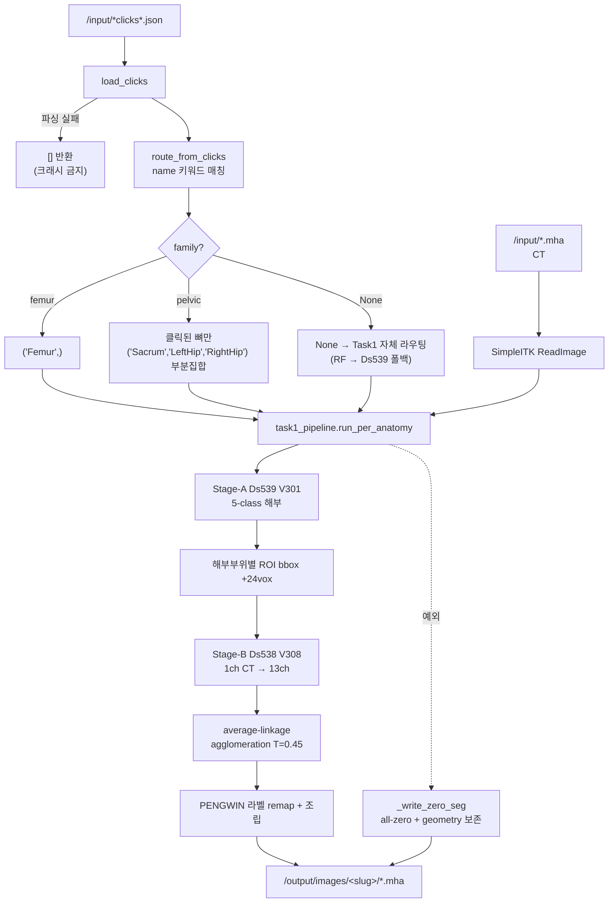

# PENGWIN 2026 — Task 2: 클릭 기반 대화형 골절 조각 분할 (PENGWIN-Interact)

[](LICENSE)
[](https://github.com/MIC-DKFZ/nnUNet)
[](https://github.com/uni-medical/STU-Net)
[-orange.svg)](https://github.com/RURUGURU/pengwin2026-task1-abbc)

> **PENGWIN 2026 Grand Challenge — Task 2**: Task 1과 동일한 골절 조각 instance 분할이되, **사전 시뮬레이션된 클릭(point prompt)** 이 함께 주어진다.
>
> 본 저장소는 **검증된 Task 1 캐스케이드(GC rank 10 기준 = v2.2, 현행 v2.4)를 그대로 재사용**하고, 클릭을 **해부부위 라우팅 결정에 주입**하는 방식으로 Task 2를 푼다. 세그멘테이션 로직을 새로 만들지 않는 것이 설계의 핵심이다.

## 🧪 v3.5 후보 — Task 1 always-on anatomy experts 적용 (`T=0.75`)

Task 1 v3.5의 Stage-B 정책을 Task 2에도 이식했다. 클릭 이름으로
`Sacrum/LeftHip/RightHip/Femur`를 강제 라우팅한 뒤, 각 anatomy에 대해
Sacrum expert, 좌·우 공용 Hip expert, Femur expert를 항상 선택한다. Stage A는
V301 fold 0을 유지하며 클릭 seed 분할은 검증에서 기각된 상태 그대로 끈다
(`PENGWIN_CLICK_INJECT=0`). 업로드 모델은 Task 1 v3.5의
`model_v3_5_always_expert_t075_20260805.tar.gz`와 바이트 동일한 번들을 Task 2
Models 탭에 별도로 등록한다.

68-case fold-0 / 4 click-strategy 감사에서 **272/272 anatomy route가 Task 1 v3.5
평가 경로와 일치**했다. 따라서 클릭이 decode를 바꾸지 않는 이 후보의
configuration-equivalent 추정치로 Task 1 v3.5 official-aligned proxy-v2를
다음과 같이 이전해 참고한다(전체 Task 2 cohort 신규 추론값은 아님):

| IoU-F | Dice | HD95 mm ↓ | ASSD mm ↓ | Instance F1 | Merge ↓ | Split ↓ |
|---:|---:|---:|---:|---:|---:|---:|
| 0.816842 | 0.855649 | 6.687 | 1.852 | 0.916377 | 21 | 330 |

이는 공식 hidden-test/leaderboard 점수가 아니라 경로 동등성이 확인된 로컬
proxy 결과다. overlap/surface는 개선되지만 기존 unified 대비 instance F1이
0.002772 낮고 split이 12건 많으므로, 현재 v3.1 Active를 자동 교체하지 않고
별도 업로드 후보로 유지한다.

---

## 🚀 현재 배포 상태 (2026-07-25, **v3.1** — 2nd place, OOM-fix)

| | |
|---|---|
| **배포 버전** | **v3.1** — 랭크 반영(ranked/deployed) Active, **2nd place**. OOM-fix 빌드로 가중치는 v3.0과 **바이트 동일**. GC 빌드는 `v3.1` 선택. `PENGWIN_CLICK_INJECT=0`(클릭은 라우팅 전용). v3.2(공식 pelvic/femur 룰 라우터)와 v3.3(클릭 seed-injection)은 태그만 존재하며 배포 config 아님 — 특히 **v3.3 클릭 seed-injection 은 REFUTED**(val rank 9 vs v3.1 rank 2: 쉬운 val 케이스에 spurious over-split 추가)이므로 배포하지 않는다 |
| **파이프라인** | 클릭 파싱 → **family 라우팅 확정** → Stage-A `V301`(해부, fold_0) → Stage-B `V308`(골절 affinity, **fold_0**) → average-linkage agglomeration decode (`AGGLO_T=0.45`) |
| **세그 로직** | `inference/task1_pipeline.py` = Task 1 배포 `inference.py`(태그 v2.4)의 **바이트 동일 사본** (md5 검증). 로직 중복 0 |
| **모델 번들** | **`model_v3_0.tar.gz`** — Task 2 알고리즘의 Models 탭에 **별도 업로드 필요** (Task 1 것이 자동 공유되지 않음). 가중치는 v2.2(rank 10)와 md5 동일, 라우터 pickle 만 sklearn 1.6.1 네이티브로 교체(경고 302→0) |
| **클릭의 역할** | 해부부위(family) 라우팅을 **확정**. 실제 클릭 1360개 전수 검사에서 pelvic 680 / femur 680, 미분류 0건. 4개 클릭 전략(uniform/EDT/center-of-mass/boundary) × 340케이스 전부에서 pelvic=항상 3뼈, 뼈 누락 0건 |
| **로컬 빌드/검증** | ✅ `pengwin-task2-interact:latest` 19.7GB 빌드 성공, shim re-export 4 클래스 확인. GC 동일조건 스모크: 클릭 파싱→라우팅→모델 로드(`w0sum` GC와 동일값)→slug 헤지 4개 기록→never-crash 계약 동작. **GPU forward 는 이 호스트(sm_120)에서 검증 불가**(컨테이너 torch 2.1.2+cu118 커널 없음; GC의 T4=sm_75 에서는 정상) |
| **GC 채점 이력** | v3.1 = **2nd place**(deployed Active). v3.3 클릭 seed-injection 은 val rank 9 로 **REFUTED**. 제출 시 §7 스모크 검증 필수 |

> ⚠️ **v1.0 은 3개의 배포 차단 결함을 고친 첫 정상 버전이다.** 이전 커밋(`e6e651f`)은 Task 1의 낡은 v1.9 Dockerfile을 복사해 왔기 때문에 **전 케이스 0점을 GREEN으로 위장하는 버그**를 갖고 있었다. v1.1 은 벤더링 코드를 Task 1 v2.4(라우터 OOD abstention)로 동기화, v1.2 는 val 제출용 릴리스 라벨. 상세는 §6.

## 목차

1. [프로젝트 개요](#1-프로젝트-개요)
2. [평가 지표](#2-평가-지표)
3. [전체 파이프라인](#3-전체-파이프라인)
4. [알고리즘 상세](#4-알고리즘-상세)
5. [클릭 좌표계 — 실측으로 확정한 것](#5-클릭-좌표계--실측으로-확정한-것)
6. [배포 결함과 수정 (2026-07-21 감사)](#6-배포-결함과-수정-2026-07-21-감사)
7. [재현 / 빌드 / 검증](#7-재현--빌드--검증)
8. [부록](#8-부록)

---

## 1. 프로젝트 개요

### 1.1 대회 / 태스크

- **대회**: PENGWIN 2026 (PElvic boNe fraGments WINdow) Grand Challenge — **Task 2 (PENGWIN-Interact)**
- **입력**: `pelvic-fracture-ct` (`.mha`) + `peripelvic-fragment-clicks.json`
- **출력**: 조각 instance 분할 `.mha` (입력과 **동일 dimension·spacing**)
- **데이터**: 340 CT × **4가지 클릭 전략 = 1,400 클릭셋**. 예선은 5 scan × 4 style = 20 케이스
- **배포 환경**: GC 컨테이너 — T4 16GB, 케이스당 10분, `--network none`

### 1.2 4가지 클릭 전략

각 CT마다 네 종류의 클릭셋이 독립적으로 생성된다.

| 전략 | 의미 |
|---|---|
| Uniformly Sampled Points of Interest | 조각 내부 균등 샘플 |
| Euclidean Distance Transform Points of Interest | EDT 극대점(조각 중심부) |
| Center of Mass Points of Interest | 조각 무게중심 |
| Boundary Internal Margin Points of Interest | 경계 안쪽 마진 |

각 point는 `name`(구조 이름)과 `point`(정수 3-tuple 좌표)를 갖는다.
`name` 예: `"Femur Uniformly Sampled Point 1"`, `"Left Hipbone ..."`, `"Sacrum ..."`.

### 1.3 PENGWIN 공식 라벨 ID 범위 (Task 1과 동일)

| ID 범위 | 해부학 | 최대 조각 수 |
|---|---|---|
| `0` | background | — |
| `1 – 50` | Sacrum (천골) | 50 |
| `51 – 100` | Left Hipbone (좌관골) | 50 |
| `101 – 150` | Right Hipbone (우관골) | 50 |
| `151 – 200` | Femur (좌·우 공용) | 50 |

### 1.4 설계 판단 — 왜 Task 1을 그대로 재사용하는가

Task 2의 채점 지표는 Task 1과 **완전히 동일한 10개**다. 즉 "클릭이 있다"는 것 말고는 같은 문제다.
Task 1 파이프라인은 GC hidden test에서 **rank 10**까지 검증된 자산이고, 그 성능의 대부분은
**37-feature RandomForest family 라우터**가 만들었다(GC instance F1 0.57 → 0.94).

클릭은 바로 그 라우팅 정보를 **무료로, 그리고 더 정확하게** 제공한다 — 클릭 `name`이 뼈 이름을
직접 말해주기 때문이다. 따라서:

> **클릭 = 라우터의 상위호환.** 세그멘테이션 네트워크는 손대지 않고, 라우팅만 클릭으로 교체한다.

실제 클릭 파일 **1360개 전수 실행** 결과 pelvic 680 / femur 680으로 **100% 분류**되었고
미분류(`family=None`)는 0건이었다. 즉 라우터 폴백 경로는 정상 조건에서 도달하지 않는다.

---

## 2. 평가 지표

Task 1과 동일한 10개 instance-level 지표. **최종 순위 = 10개 지표 각각의 순위를 평균한 Mean Position**
(화면의 `Score (Dice)`는 정렬 키가 아니다).

| 방향 | 지표 |
|---|---|
| 높을수록 좋음 | Fracture Dice, Local Dice (20mm), Instance Recall, Instance Precision, Instance F1, Topology Consistency |
| 낮을수록 좋음 | HD95 (mm), ASSD (mm), Merge Error Count, Split Error Count |

**계산 규칙**: GT 조각 500 mm³ 미만 제외 · 양측 1 cm³ CC prune · 해부부위별 argmax IoU 매칭.

### 2.1 merge / split 비대칭 (전략의 핵심)

| 사건 | 손상되는 지표 수 |
|---|---|
| **merge 1건** (두 조각을 하나로 병합) | **7 / 10** — Dice, HD95, ASSD, Recall, F1, Merge, Topology |
| over-split 1건 (한 조각을 둘로 분리) | 4 / 10 — Precision, Split, F1(약), Dice(약) |

`Topology = merge가 없는 부위의 비율`이므로 **과분할은 topology를 전혀 깎지 않는다**.
⇒ 모호할 때는 **쪼개는 쪽**이 싸다.

---

## 3. 전체 파이프라인

```
/input/pelvic-fracture-ct.mha
/input/peripelvic-fragment-clicks.json
        │
        ├─ load_clicks()          JSON 파싱 (단일 dict / list 모두 허용, 실패 시 [] 반환)
        ├─ route_from_clicks()    name 키워드 → family + 클릭된 뼈 집계
        └─ anatomies_from_routing()  → 강제 해부부위 튜플
                │
                ▼
        ┌───────────────────────────────────────────────┐
        │  task1_pipeline.run_per_anatomy(              │
        │      anatomies=forced)   ← 여기서만 클릭이 개입 │
        │                                               │
        │   Stage-A  Ds539 V301  5-class 해부 분할       │
        │   (forced 가 있으면 RF/Ds539 자동 라우팅 skip) │
        │      ↓ 해부부위별 ROI bbox (+24 vox pad)       │
        │   Stage-B  Ds538 V308  1ch CT → 13ch          │
        │      = 4 ABBC + 9 affinity                    │
        │      ↓ average-linkage agglomeration (T=0.45) │
        │   PENGWIN 라벨 범위로 remap & 조립             │
        └───────────────────────────────────────────────┘
                │
                ▼
/output/images/<slug>/<입력파일명>.mha   (uint8, 0..200, geometry 보존)
```

### 3.1 파이프라인 도식 (mermaid)



---

## 4. 알고리즘 상세

### 4.1 클릭 파싱 — `load_clicks()`

- 단일 strategy dict, strategy들의 list 두 형태를 모두 수용
- `OSError` / `ValueError` 는 삼켜서 `[]` 반환 — **클릭 문제로 컨테이너가 죽지 않는다**
- 입력 경로 탐색은 4단계 glob 폴백:
  `/input/peripelvic-fragment-clicks.json` → `/input/*click*.json` → `/input/**/*click*.json` → `/input/*.json`

### 4.2 family 라우팅 — `route_from_clicks()`

```python
_FEMUR_KEYWORDS  = ("femur",)
_PELVIC_KEYWORDS = ("hip", "ilium", "sacrum", "pelvi")   # "Left Hipbone" 포함
```

point의 `name`을 소문자화해 키워드 매칭 → femur/pelvic 표를 집계.
동시에 **어떤 골반뼈가 클릭됐는지**도 따로 센다.

### 4.3 강제 해부부위 — `anatomies_from_routing()`

| 라우팅 결과 | 반환 |
|---|---|
| femur | `("Femur",)` |
| pelvic | 클릭된 뼈들의 부분집합 (예: `("Sacrum","LeftHip")`) |
| 판단 불가 | `None` → Task 1 자체 라우팅으로 폴백 |

`None`이 아니면 Task 1 쪽에서 자동 라우팅을 **단락(short-circuit)** 한다:

```python
if forced_anatomies is not None:
    anatomies = tuple(forced_anatomies)      # RF/Ds539 라우팅 skip
```

**중요**: pelvic에서 클릭된 뼈만 처리하면 클릭 없는 뼈는 아예 추론하지 않는다 → 시간 예산도 절약된다.

### 4.4 조각 시딩 — 구현된 훅, 아직 비활성

`clicks_to_voxel_seeds()` 는 클릭 좌표를 numpy `(z,y,x)` 인덱스로 변환해 **계산·로깅까지 하지만
디코더에 넣지는 않는다**. 이는 의도된 미완성이며, docstring에 두 개의 주입 지점이 명시돼 있다:

1. **core-seed watershed**: 클릭 위치를 강제 seed 라벨로 심기
2. **affinity must-link / cannot-link**: 같은 조각 클릭쌍은 must-link, 다른 조각은 cannot-link

> 이것이 Task 2의 **가장 큰 미개척 레버**다. 현재는 클릭을 라우팅에만 쓰므로, 조각 분리 성능은
> Task 1과 동일한 천장(= merge 문제)에 걸린다. §8.2 참조.

### 4.5 절대 크래시하지 않는 계약

```
run() 예외        → _write_zero_seg(ref_img, out_path)  → return out_path
main() 예외       → CT 재로드 후 _write_zero_seg        → return 0
_write_zero_seg   → CT와 동일 geometry의 all-zero uint8
```

GC는 산출물이 없으면 실패 처리하므로, **틀린 답이라도 규격에 맞는 파일**을 내는 것이 항상 낫다.

> ⚠️ 단, exit 0 + 파일 존재가 곧 성공은 아니다. v1.0부터는 전부-배경 산출물을 감지하면 로그에
> 크게 경고를 남긴다(§6.1의 사고를 재발 방지하기 위함).

---

## 5. 클릭 좌표계 — 실측으로 확정한 것

챌린지 스펙은 `point`가 3개 정수라고만 하고 **축 순서를 명시하지 않는다**. 그래서 실제 학습
데이터로 직접 결정했다:

| 해석 | 클릭이 해당 라벨 복셀에 적중한 비율 |
|---|---|
| `(x, y, z)` | 13 / 62 = **21%** |
| **`(z, y, x)`** | **62 / 62 = 100%** |

⇒ `_ORDER` 기본값 = `"zyx"`. `PENGWIN_CLICK_ORDER` 환경변수로 `xyz` / `zyx` / `world` 전환 가능.

---

## 6. 배포 결함과 수정 (2026-07-21 감사)

24개 에이전트 적대 검증으로 발견된 배포 차단 결함들. **모두 v1.0에서 수정됨.**

### 6.1 🔴 `PENGWIN_DS538_FOLD=all` — 전 케이스 0점을 GREEN으로 위장

이 저장소의 첫 커밋(`e6e651f`)은 Task 1 개발 클론의 **낡은 v1.9 Dockerfile**을 복사해 왔다.
그 값이 유효하던 `model_v1_9.tar.gz`는 이미 삭제되었고, 현존 tarball에는 `fold_0`뿐이다.

> ℹ️ **Task 1의 배포본은 이 결함의 영향을 받은 적이 없다.** Task 1 원격의 `v2.2`(커밋 `4542487`)는
> 처음부터 `PENGWIN_DS538_FOLD=0` + `PENGWIN_TARGET_ROUTER=1` 을 올바르게 갖고 있었다. 문제는 로컬
> 개발 클론이 v1.9(`20202eb`)에 머물러 있었고 **Task 2가 하필 그 낡은 사본에서 파생**되었다는 점이다.
> 즉 이것은 Task 2 고유의 결함이며, rank-10 Task 1 컨테이너는 무관하다.

```
Dockerfile        PENGWIN_DS538_FOLD=all
task1_pipeline.py use_folds=(("all" if fold=="all" else int(fold)),)
nnunetv2 2.5.1    torch.load(join(model_dir, f"fold_{f}", ckpt))   ← isfile 검사 없음, 폴백 없음
model_v2_2.tar.gz .../PengwinTrainerSTUNetBaseAffinityV308__.../fold_0/checkpoint_best.pth
                                                                  ^^^^^^ fold_all 없음
```

→ 예외 → 포괄 `except` → `_write_zero_seg` → **`return 0`**
→ **GC는 "성공(GREEN)"으로 기록하고 전 케이스 0점.**

**수정**: `PENGWIN_DS538_FOLD=0`. Dockerfile에 되돌리지 말라는 근거를 주석으로 박아뒀다.

### 6.2 🟠 `PENGWIN_TARGET_ROUTER` 미설정 — RF 라우터가 죽은 코드

```python
TARGET_ROUTER_ENABLED = os.environ.get("PENGWIN_TARGET_ROUTER", "0") == "1"   # 기본 OFF
```

Task 2에서는 클릭이 해부부위를 강제하므로 이 경로는 **정상 조건에서 도달하지 않는다**
(실 클릭 1360개 전수 검사에서 미분류 0건). 그러나 클릭 JSON이 없거나 파싱 불가한 퇴화 케이스에서는
pre-v2.0 Ds539 부피비 라우팅(GC instance F1 **0.572**)으로 조용히 퇴화한다.

**수정**: `PENGWIN_TARGET_ROUTER=1` 추가 — **무료 보험**. 라우터 아티팩트는 이미 모델 tarball
안(`./stage1_router/stage1_target_router_fold0.joblib`)에 들어 있다.
또한 `scikit-learn==1.6.1`로 핀 고정(requirements.txt 와 일치) — 배포 tarball 의 라우터 pickle 이 이 버전으로 덤프되었고, 버전이 어긋나면
경고와 함께 미묘하게 다른 트리를 로드하거나 아예 실패한다.

### 6.3 🟠 폴백 경로가 `None` 이라는 이름의 파일을 씀

```python
# 이전 (버그)
out_path = _resolve_output_seg(args[2] if len(args) >= 3 else None)
#                              ↑ 유일한 positional 이 ct_path 에 바인딩됨

# 시그니처
def _resolve_output_seg(ct_path, explicit=None): ...
```

GC에는 argv가 없으므로 `ct_path=None` → `os.path.basename(str(None))` → `.../None`
(확장자 없음, GC가 임포트 불가). **최후의 안전망이 오히려 못 읽는 산출물을 만들었다.**

**수정**: 두 인자를 명시적으로 전달.

### 6.4 🟡 출력 인터페이스 slug 불확실성

Task 2의 출력 slug가 문서상 확정되지 않았다. 문서(`02-*.md:12`)는
`pelvic-fracture-segmentation`이라 하지만, **같은 스타일의 문서 줄이 Task 1에서는 틀렸던 전례**가
있다 — Task 1 문서는 `peripelvic-fracture-segmentation`이라 적었지만 실제 GC 채점된 배포본은
`peripelvic-fracture-**ct**-segmentation`을 쓴다.

**수정 (2단 헤지)**:
1. `/input/inputs.json`이 있으면 거기서 slug를 읽는다 — **런타임 권위 소스**
2. 없으면 후보 slug **전부**에 동일한 `.mha`를 쓴다. GC는 선언된 소켓만 임포트하므로 부작용 없음

```python
OUTPUT_SLUG_CANDIDATES = (
    "pelvic-fracture-segmentation",
    "pelvic-fracture-ct-segmentation",
    "peripelvic-fracture-ct-segmentation",
    "peripelvic-fracture-segmentation",
)
```

> 이 불확실성은 GC에 로그인해 알고리즘의 **Interfaces/Sockets 패널**을 5분만 보면 확정된다.
> 확정되면 헤지를 제거해도 된다.

---

## 7. 재현 / 빌드 / 검증

### 7.1 저장소 구조

```
.
├── Dockerfile                       GC 컨테이너 정의 (모델 선택 ENV 포함)
├── requirements.txt                 torch 2.1.2+cu118 / nnunetv2 2.5.1 / scikit-learn 1.6.1 핀
├── inference/
│   ├── inference.py                 ★ Task 2 고유 진입점 (클릭 파싱 + 라우팅 주입) — 컨테이너 내 유일한 Task-2 전용 코드
│   ├── task1_pipeline.py            Task 1 배포 inference.py(v2.4) 의 바이트 동일 사본
│   ├── agglo_decode.py              average-linkage agglomeration 디코드 (Task 1 벤더링)
│   ├── target_family_router.py      37-feature RF family 라우터 (Task 1 벤더링)
│   └── pengwin_trainers_shim.py     nnUNet trainer discovery shim (Task 1 벤더링)
├── code_task1/                      ★ Task 1 코드베이스 벤더링 (core.py/loss.py/model.py …).
│                                    shim 이 여기서 `import core` 로 PengwinTrainer 클래스를 로드한다.
│                                    이름이 code_task1 인 것은 의도적 — Task 2 는 Task 1 세그 스택을
│                                    그대로 재사용하므로 code_task2 로 바꾸면 안 된다(Dockerfile COPY /
│                                    PYTHONPATH / shim `_CODE_DIR` 이 이 경로에 의존).
└── scripts/build_image.sh
```

> **컨테이너 안에서 "Task 2 고유" 코드는 `inference/inference.py` 하나뿐이다.** 나머지(`code_task1/`,
> `task1_pipeline.py`, `agglo_decode.py`, 라우터, shim)는 전부 Task 1 배포본에서 그대로 가져온 것이다.
> 프로젝트 루트의 `code_task2/`(dev 스캐폴드)는 배포 repo 와 무관하며 컨테이너에 들어가지 않는다.

### 7.2 모델 번들

**`model_v3_0.tar.gz`** 를 **이 알고리즘(Task 2)의 Models 탭에 별도로** 올린다 (Task 1 것이 자동
공유되지 않는다). 별도 학습 없음. `sha256 560dff90…`. 가중치는 v2.2(rank 10)와 md5 동일하고 라우터
pickle 만 sklearn 1.6.1 네이티브로 교체된 판이다(1.7.2 판 `model_v2_2.tar.gz` 는 로드 시 경고 302건 →
1.6.1 판은 0건). **`model_v2_3.tar.gz`(rank 44)를 올리지 말 것.**

```
/opt/ml/model/
├── nnunet/results/Dataset539_.../PengwinTrainerSTUNetBaseAnatomyV301__.../fold_0/checkpoint_best.pth
├── nnunet/results/Dataset538_.../PengwinTrainerSTUNetBaseAffinityV308__.../fold_0/checkpoint_best.pth
└── stage1_router/stage1_target_router_fold0.joblib
```

### 7.3 로컬 실행

```bash
PENGWIN_INPUT_CT=/path/to/image.mha \
PENGWIN_INPUT_CLICKS=/path/to/clicks.json \
PENGWIN_OUTPUT_DIR=/tmp/out \
PENGWIN_ROOT=/path/to/model_root \
python inference/inference.py
```

### 7.4 ⚠️ 제출 전 필수 스모크 검증

**"job succeeded"를 성공으로 받아들이지 말 것.** §6.1의 결함은 완전히 깨진 상태에서도
exit 0 + 파일 존재를 만족한다. 반드시 산출물 자체를 확인하라:

```python
import SimpleITK as sitk, numpy as np
a = sitk.GetArrayFromImage(sitk.ReadImage("out.mha"))
assert len(np.unique(a)) > 1, "전부 배경 = 파이프라인이 조용히 죽었다"
print("labels:", np.unique(a)[:20])
```

로그에서도 확인할 것:
- `w0sum ≈ 104` (95 미만이면 랜덤 네트워크 = GC 0점)
- `target-router: loaded ... n_features=37 labels=['pelvic','femur']`
- `클릭 N개 파싱 → family=...`

---

## 8. 부록

### 8.1 환경변수

| 변수 | 기본값 | 의미 |
|---|---|---|
| `PENGWIN_DS538_TRAINER` | `...AffinityV308` | Stage-B 트레이너 |
| `PENGWIN_DS538_FOLD` | **`0`** | **모델 tarball의 fold 디렉터리와 반드시 일치** |
| `PENGWIN_DS538_OUT_CH` | `13` | 4 ABBC + 9 affinity |
| `PENGWIN_AFFINITY_DECODE` | `1` | agglomeration 디코드 사용 |
| `PENGWIN_AGGLO_T` | `0.45` | agglomeration 임계값 (T에 둔감함이 68케이스 sweep으로 확인됨) |
| `PENGWIN_TARGET_ROUTER` | **`1`** | RF family 라우터 (Task 2에선 클릭 실패 시 보험) |
| `PENGWIN_CLICK_ORDER` | `zyx` | 클릭 좌표 축 순서 |
| `PENGWIN_INPUTS_JSON` | `/input/inputs.json` | 출력 slug 권위 소스 |

### 8.2 다음 레버 (미구현)

1. **클릭을 디코더에 실제로 주입** — 현재 클릭은 라우팅에만 쓰인다. `clicks_to_voxel_seeds()`가
   이미 좌표를 정확히 계산하므로, core-seed watershed의 강제 seed 또는 affinity의
   must-link/cannot-link 제약으로 넣으면 **merge 문제에 직접 개입**할 수 있다. Task 2에서만
   가능한 정보이며, Task 1의 근본 한계(융합 계면 ~5% 대비)를 우회하는 유일한 경로다.
2. **클릭 개수 기반 조각 수 사전정보** — 조각당 클릭이 하나씩이라면 클릭 수가 곧 GT 조각 수의
   하한이다. agglomeration을 그 수에 맞춰 멈추게 할 수 있다.

### 8.3 감사 (Acknowledgements)

- [nnU-Net](https://github.com/MIC-DKFZ/nnUNet) — MIC-DKFZ
- [STU-Net](https://github.com/uni-medical/STU-Net) — uni-medical (Apache-2.0)
- ABBC 표현 — PENGWIN 2024 CT 트랙 우승 방법
- GASP average-linkage agglomeration — Bailoni et al., CVPR 2022

### 8.4 라이선스

MIT — [LICENSE](LICENSE) 참조.
