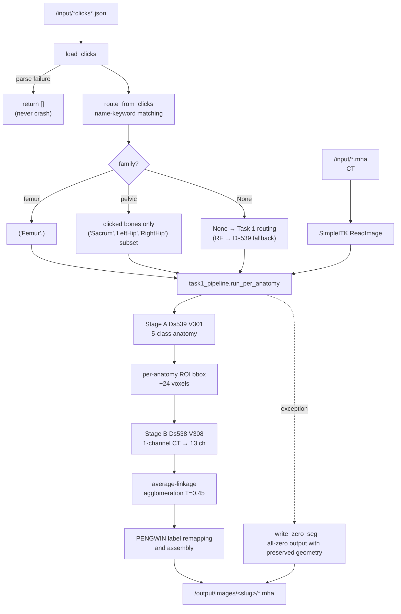

# PENGWIN 2026 — Task 2: Click-Guided Interactive Fracture Fragment Segmentation (PENGWIN-Interact)

[](LICENSE)
[](https://github.com/MIC-DKFZ/nnUNet)
[](https://github.com/uni-medical/STU-Net)
[-orange.svg)](https://github.com/RURUGURU/pengwin2026-task1-abbc)

> **PENGWIN 2026 Grand Challenge — Task 2** uses the same fracture-fragment
> instance-segmentation task as Task 1, with an additional set of
> **pre-simulated clicks (point prompts)**.
>
> This repository reuses the **validated Task 1 cascade (GC rank-10 baseline =
> v2.2, current v2.4)** and injects click information into the anatomy-routing
> decision. The central design choice is to avoid replacing the segmentation
> logic.

## 🧪 v3.5 Candidate — Task 1 Always-On Anatomy Experts (`T=0.75`)

This candidate ports the Task 1 v3.5 Stage-B policy to Task 2. It first forces
the anatomy route to `Sacrum/LeftHip/RightHip/Femur` from the click names, then
always selects the Sacrum expert, shared left/right Hip expert, or Femur expert
for the routed anatomy. Stage A remains V301 fold 0, and click-seed splitting
remains disabled as rejected by validation (`PENGWIN_CLICK_INJECT=0`). Upload a
byte-identical copy of the Task 1 v3.5
`model_v3_5_always_expert_t075_20260805.tar.gz` bundle separately under the Task
2 Models tab.

In a 68-case fold-0 audit across four click strategies, **all 272/272 anatomy
routes matched the Task 1 v3.5 evaluation path**. Because clicks do not alter
decoding in this candidate, the Task 1 v3.5 official-aligned proxy-v2 results
are transferred below as a configuration-equivalent estimate. They are not new
inference results over the full Task 2 cohort.

| IoU-F | Dice | HD95 mm ↓ | ASSD mm ↓ | Instance F1 | Merge ↓ | Split ↓ |
|---:|---:|---:|---:|---:|---:|---:|
| 0.816842 | 0.855649 | 6.687 | 1.852 | 0.916377 | 21 | 330 |

These are local proxy results, not official hidden-test or leaderboard scores.
Although overlap and surface metrics improve, instance F1 is 0.002772 lower and
there are 12 more split errors than with the existing unified model. The
candidate is therefore retained as a separate upload and does not automatically
replace the current v3.1 Active deployment.

---

## 🚀 Current Deployment Status (2026-07-25, **v3.1** — 2nd Place, OOM Fix)

| | |
|---|---|
| **Deployed version** | **v3.1** — ranked/deployed Active, **2nd place**. This is the OOM-fix build; its weights are byte-identical to v3.0. Select `v3.1` for the GC build. `PENGWIN_CLICK_INJECT=0` (clicks are used only for routing). v3.2 (official pelvic/femur rule router) and v3.3 (click seed injection) exist only as tags and are not deployment configurations. In particular, **v3.3 click seed injection was REFUTED** (validation rank 9 versus v3.1 rank 2 because it introduced spurious over-splits in easy validation cases), so do not deploy it. |
| **Pipeline** | Click parsing → **family route selection** → Stage A `V301` (anatomy, fold 0) → Stage B `V308` (fracture affinity, **fold 0**) → average-linkage agglomeration decoding (`AGGLO_T=0.45`) |
| **Segmentation logic** | `inference/task1_pipeline.py` is a **byte-identical copy** of the Task 1 deployed `inference.py` (tag v2.4; verified by MD5). There is no duplicated logic. |
| **Model bundle** | **`model_v3_0.tar.gz`** — must be uploaded separately under the Task 2 algorithm's Models tab because the Task 1 model is not shared automatically. The weights are MD5-identical to v2.2 (rank 10); only the router pickle was replaced with a native scikit-learn 1.6.1 artifact (302 warnings → 0). |
| **Role of clicks** | Clicks **determine the anatomy family route**. An exhaustive audit of all 1,360 real click files found 680 pelvic and 680 femur cases, with zero unclassified cases. Across four click strategies (uniform/EDT/center-of-mass/boundary) × 340 cases, pelvic cases always contained three bones and no bone was omitted. |
| **Local build/validation** | ✅ Successfully built `pengwin-task2-interact:latest` (19.7 GB) and verified that the shim re-exports four classes. A GC-equivalent smoke test covered click parsing, routing, model loading (`w0sum` identical to GC), all four output-slug hedges, and the never-crash contract. **GPU forward inference could not be validated on this host (sm_120)** because the container's PyTorch 2.1.2+cu118 lacks that kernel; it works on the GC T4 (sm_75). |
| **GC evaluation history** | v3.1 = **2nd place** (deployed Active). v3.3 click seed injection was **REFUTED** at validation rank 9. The smoke test in §7 is mandatory before submission. |

> ⚠️ **v1.0 was the first working release after three deployment-blocking defects
> were fixed.** The earlier commit (`e6e651f`) copied an obsolete Task 1 v1.9
> Dockerfile and contained a bug that could disguise an all-zero result as a
> GREEN success for every case. v1.1 synchronized the vendored code with Task 1
> v2.4 (router OOD abstention), and v1.2 was the validation-submission release.
> See §6 for details.

## Table of Contents

1. [Project Overview](#1-project-overview)
2. [Evaluation Metrics](#2-evaluation-metrics)
3. [Pipeline Overview](#3-pipeline-overview)
4. [Algorithm Details](#4-algorithm-details)
5. [Click Coordinate Order — Empirically Verified](#5-click-coordinate-order--empirically-verified)
6. [Deployment Defects and Fixes (2026-07-21 Audit)](#6-deployment-defects-and-fixes-2026-07-21-audit)
7. [Reproduction, Build, and Validation](#7-reproduction-build-and-validation)
8. [Appendix](#8-appendix)

---

## 1. Project Overview

### 1.1 Challenge and Task

- **Challenge:** PENGWIN 2026 (PElvic boNe fraGments WINdow) Grand Challenge — **Task 2 (PENGWIN-Interact)**
- **Input:** `pelvic-fracture-ct` (`.mha`) + `peripelvic-fragment-clicks.json`
- **Output:** Fragment instance segmentation in `.mha` format, with the **same dimensions and spacing** as the input
- **Data:** 340 CT scans × **four click strategies = 1,360 click sets**. The preliminary phase uses 5 scans × 4 styles = 20 cases.
- **Deployment environment:** GC container — T4 16 GB, 10 minutes per case, `--network none`

### 1.2 Four Click Strategies

Four click sets are generated independently for every CT scan.

| Strategy | Meaning |
|---|---|
| Uniformly Sampled Points of Interest | Uniform sampling inside fragments |
| Euclidean Distance Transform Points of Interest | EDT maxima near fragment centers |
| Center of Mass Points of Interest | Fragment centers of mass |
| Boundary Internal Margin Points of Interest | Internal margins near fragment boundaries |

Each point has a `name` (structure name) and a `point` (integer 3-tuple).
Examples include `"Femur Uniformly Sampled Point 1"`, `"Left Hipbone ..."`, and
`"Sacrum ..."`.

### 1.3 Official PENGWIN Label-ID Ranges (Same as Task 1)

| ID range | Anatomy | Maximum fragments |
|---|---|---|
| `0` | Background | — |
| `1 – 50` | Sacrum | 50 |
| `51 – 100` | Left hipbone | 50 |
| `101 – 150` | Right hipbone | 50 |
| `151 – 200` | Femur (shared by left and right) | 50 |

### 1.4 Design Rationale — Why Reuse Task 1 Unchanged?

Task 2 uses **exactly the same ten evaluation metrics** as Task 1. Apart from the
availability of clicks, it is the same problem. The Task 1 pipeline is an asset
validated up to **rank 10** on the GC hidden test, and most of its performance
came from the **37-feature RandomForest family router** (GC instance F1 0.57 →
0.94).

Clicks provide the same routing information **for free and more accurately**,
because every click's `name` directly identifies the bone. Therefore:

> **Clicks supersede the router.** The segmentation networks remain unchanged;
> only routing is replaced by click-based routing.

An exhaustive run over **all 1,360 click files** classified 680 as pelvic and
680 as femur, with zero unclassified cases (`family=None`). The router fallback
is therefore unreachable under normal conditions.

---

## 2. Evaluation Metrics

Task 2 uses the same ten instance-level metrics as Task 1. The **final ranking is
the mean position across the ranks for all ten metrics**; the displayed `Score
(Dice)` is not the sorting key.

| Direction | Metrics |
|---|---|
| Higher is better | Fracture Dice, Local Dice (20 mm), Instance Recall, Instance Precision, Instance F1, Topology Consistency |
| Lower is better | HD95 (mm), ASSD (mm), Merge Error Count, Split Error Count |

**Evaluation rules:** Exclude GT fragments smaller than 500 mm³ · prune CCs
smaller than 1 cm³ on both sides · perform argmax-IoU matching per anatomy.

### 2.1 Merge/Split Asymmetry (Central to the Strategy)

| Event | Number of affected metrics |
|---|---|
| **One merge** (two fragments combined into one) | **7/10** — Dice, HD95, ASSD, Recall, F1, Merge, Topology |
| One over-split (one fragment divided into two) | 4/10 — Precision, Split, F1 (slightly), Dice (slightly) |

Because `Topology` is the fraction of anatomies without a merge, **over-splitting
does not reduce topology at all**. When uncertain, splitting is less costly.

---

## 3. Pipeline Overview

```
/input/pelvic-fracture-ct.mha
/input/peripelvic-fragment-clicks.json
        │
        ├─ load_clicks()             Parse JSON (accept a dict or list; return [] on failure)
        ├─ route_from_clicks()       Match name keywords → family + clicked-bone counts
        └─ anatomies_from_routing()  → forced anatomy tuple
                │
                ▼
        ┌─────────────────────────────────────────────────┐
        │  task1_pipeline.run_per_anatomy(                │
        │      anatomies=forced)  ← clicks intervene here │
        │                                                 │
        │   Stage A  Ds539 V301  5-class anatomy          │
        │   (forced skips RF/Ds539 automatic routing)     │
        │      ↓ per-anatomy ROI bbox (+24-voxel pad)     │
        │   Stage B  Ds538 V308  1-channel CT → 13 ch     │
        │      = 4 ABBC + 9 affinity                      │
        │      ↓ average-linkage agglomeration (T=0.45)   │
        │   Remap to PENGWIN label ranges and assemble    │
        └─────────────────────────────────────────────────┘
                │
                ▼
/output/images/<slug>/<input-filename>.mha  (uint8, 0..200, geometry preserved)
```

### 3.1 Pipeline Diagram (Mermaid)



---

## 4. Algorithm Details

### 4.1 Click Parsing — `load_clicks()`

- Accepts either a single strategy dict or a list of strategy dicts
- Catches `OSError` and `ValueError` and returns `[]`, so click problems **never crash the container**
- Uses a four-stage input-path fallback:
  `/input/peripelvic-fragment-clicks.json` → `/input/*click*.json` → `/input/**/*click*.json` → `/input/*.json`

### 4.2 Family Routing — `route_from_clicks()`

```python
_FEMUR_KEYWORDS  = ("femur",)
_PELVIC_KEYWORDS = ("hip", "ilium", "sacrum", "pelvi")  # includes "Left Hipbone"
```

Each point's `name` is lowercased and matched against the keywords to vote for
the femur or pelvic family. The code also counts **which individual pelvic bones
were clicked**.

### 4.3 Forced Anatomies — `anatomies_from_routing()`

| Routing result | Return value |
|---|---|
| Femur | `("Femur",)` |
| Pelvic | Subset of clicked bones, for example `("Sacrum","LeftHip")` |
| Unknown | `None` → fall back to Task 1 routing |

When the return value is not `None`, Task 1 **short-circuits** automatic routing:

```python
if forced_anatomies is not None:
    anatomies = tuple(forced_anatomies)  # skip RF/Ds539 routing
```

**Important:** For pelvic cases, only clicked bones are processed. Bones without
clicks are not inferred, which also reduces inference time.

### 4.4 Fragment Seeding — Hook Implemented, Currently Disabled

`clicks_to_voxel_seeds()` converts click coordinates to NumPy `(z,y,x)` indices
and computes/logs them, but does **not** yet pass them to the decoder. This is
intentional; the docstring identifies two possible injection points:

1. **Core-seed watershed:** insert click locations as forced seed labels
2. **Affinity must-link/cannot-link:** clicks on the same fragment are must-link; clicks on different fragments are cannot-link

> This remains Task 2's **largest unexplored lever**. Because clicks are currently
> used only for routing, fragment separation has the same ceiling as Task 1 (the
> merge problem). See §8.2.

### 4.5 Never-Crash Contract

```
run() exception        → _write_zero_seg(ref_img, out_path)  → return out_path
main() exception       → reload CT, then _write_zero_seg      → return 0
_write_zero_seg        → all-zero uint8 with CT geometry
```

GC treats a missing output as a failure, so a specification-compliant file is
always preferable to no output, even if its prediction is wrong.

> ⚠️ However, exit code 0 plus an existing file does not prove success. Since
> v1.0, an all-background result triggers a prominent log warning to prevent a
> recurrence of the incident described in §6.1.

---

## 5. Click Coordinate Order — Empirically Verified

The challenge specification states only that `point` contains three integers;
it does **not specify the axis order**. We therefore determined it from the
actual training data:

| Interpretation | Fraction of clicks hitting the corresponding label voxel |
|---|---|
| `(x, y, z)` | 13/62 = **21%** |
| **`(z, y, x)`** | **62/62 = 100%** |

The default `_ORDER` is therefore `"zyx"`. The `PENGWIN_CLICK_ORDER` environment
variable can switch between `xyz`, `zyx`, and `world`.

---

## 6. Deployment Defects and Fixes (2026-07-21 Audit)

The following deployment-blocking defects were found through adversarial
validation by 24 agents. **All were fixed in v1.0.**

### 6.1 🔴 `PENGWIN_DS538_FOLD=all` — Disguised All-Zero Results as GREEN Successes

The repository's first commit (`e6e651f`) copied an **obsolete v1.9 Dockerfile**
from a Task 1 development clone. The corresponding `model_v1_9.tar.gz` had
already been deleted, and the remaining tarballs contained only `fold_0`.

> ℹ️ **The deployed Task 1 submission was never affected by this defect.** Task 1
> remote v2.2 (commit `4542487`) correctly contained
> `PENGWIN_DS538_FOLD=0` and `PENGWIN_TARGET_ROUTER=1` from the beginning. The
> local development clone had remained on v1.9 (`20202eb`), and Task 2 happened
> to be derived from that stale copy. This defect was therefore specific to Task
> 2 and unrelated to the rank-10 Task 1 container.

```
Dockerfile        PENGWIN_DS538_FOLD=all
task1_pipeline.py use_folds=(("all" if fold=="all" else int(fold)),)
nnunetv2 2.5.1    torch.load(join(model_dir, f"fold_{f}", ckpt))  ← no isfile check or fallback
model_v2_2.tar.gz .../PengwinTrainerSTUNetBaseAffinityV308__.../fold_0/checkpoint_best.pth
                                                                  ^^^^^^ no fold_all
```

→ exception → broad `except` → `_write_zero_seg` → **`return 0`**
→ **GC records “success” (GREEN), but every case scores zero.**

**Fix:** Set `PENGWIN_DS538_FOLD=0`. The Dockerfile includes comments explaining
why this must not be reverted.

### 6.2 🟠 Missing `PENGWIN_TARGET_ROUTER` — Dead RF Router Code

```python
TARGET_ROUTER_ENABLED = os.environ.get("PENGWIN_TARGET_ROUTER", "0") == "1"  # OFF by default
```

In Task 2, clicks force the anatomy route, so this path is **not reached under
normal conditions** (the audit of all 1,360 real click files found zero
unclassified cases). If the click JSON is missing or cannot be parsed, however,
the pipeline silently degrades to pre-v2.0 Ds539 volume-ratio routing (GC
instance F1 **0.572**).

**Fix:** Add `PENGWIN_TARGET_ROUTER=1` as **free insurance**. The router artifact
is already inside the model tarball at
`./stage1_router/stage1_target_router_fold0.joblib`. Also pin
`scikit-learn==1.6.1` to match `requirements.txt`: the deployment tarball's
router pickle was created with that version, while a mismatch can load subtly
different trees with warnings or fail completely.

### 6.3 🟠 Fallback Wrote to a File Named `None`

```python
# Before (bug)
out_path = _resolve_output_seg(args[2] if len(args) >= 3 else None)
#                              ↑ the only positional argument binds to ct_path

# Signature
def _resolve_output_seg(ct_path, explicit=None): ...
```

GC supplies no command-line arguments, so `ct_path=None` caused
`os.path.basename(str(None))` to produce `.../None`. This has no extension and
cannot be imported by GC. **The final safety net produced an unreadable output.**

**Fix:** Pass both arguments explicitly.

### 6.4 🟡 Uncertain Output-Interface Slug

The Task 2 output slug had not been confirmed in the documentation. The
documentation (`02-*.md:12`) says `pelvic-fracture-segmentation`, but a similarly
formatted line was wrong for Task 1: it specified
`peripelvic-fracture-segmentation`, while the deployed and evaluated GC build
used `peripelvic-fracture-**ct**-segmentation`.

**Fix (two-level hedge):**

1. Read the slug from `/input/inputs.json` when available; this is the **runtime authority**.
2. Otherwise, write the same `.mha` file under **all candidate slugs**. GC imports only the declared socket, so this has no side effects.

```python
OUTPUT_SLUG_CANDIDATES = (
    "pelvic-fracture-segmentation",
    "pelvic-fracture-ct-segmentation",
    "peripelvic-fracture-ct-segmentation",
    "peripelvic-fracture-segmentation",
)
```

> This uncertainty can be resolved in five minutes by signing in to GC and
> checking the algorithm's **Interfaces/Sockets** panel. Once confirmed, the
> hedge can be removed.

---

## 7. Reproduction, Build, and Validation

### 7.1 Repository Structure

```
.
├── Dockerfile                       GC container definition, including model-selection ENV
├── requirements.txt                 Pins torch 2.1.2+cu118, nnunetv2 2.5.1, scikit-learn 1.6.1
├── inference/
│   ├── inference.py                 ★ Task 2 entry point (click parsing + routing injection); the only Task-2-specific container code
│   ├── task1_pipeline.py            Byte-identical copy of the Task 1 deployed inference.py (v2.4)
│   ├── agglo_decode.py              Average-linkage agglomeration decoder (vendored from Task 1)
│   ├── target_family_router.py      37-feature RF family router (vendored from Task 1)
│   └── pengwin_trainers_shim.py     nnUNet trainer-discovery shim (vendored from Task 1)
├── code_task1/                      ★ Vendored Task 1 codebase (core.py/loss.py/model.py, etc.)
│                                    The shim loads the PengwinTrainer classes from here via `import core`.
│                                    The name code_task1 is intentional: Task 2 reuses the Task 1
│                                    segmentation stack unchanged. Do not rename it to code_task2;
│                                    Dockerfile COPY, PYTHONPATH, and the shim's `_CODE_DIR` depend on it.
└── scripts/build_image.sh
```

> **The only Task-2-specific code inside the container is
> `inference/inference.py`.** Everything else (`code_task1/`,
> `task1_pipeline.py`, `agglo_decode.py`, the router, and the shim) comes directly
> from the Task 1 deployment. The development scaffold `code_task2/` in the
> parent project is unrelated to this deployment repository and is not included
> in the container.

### 7.2 Model Bundle

Upload **`model_v3_0.tar.gz` separately under this Task 2 algorithm's Models
tab** because the Task 1 model is not shared automatically. No separate training
is required. SHA-256 begins with `560dff90…`. The weights are MD5-identical to
v2.2 (rank 10); only the router pickle was replaced by a native scikit-learn
1.6.1 artifact (the 1.7.2 `model_v2_2.tar.gz` produced 302 load warnings, versus
zero for the 1.6.1 artifact). **Do not upload `model_v2_3.tar.gz` (rank 44).**

```
/opt/ml/model/
├── nnunet/results/Dataset539_.../PengwinTrainerSTUNetBaseAnatomyV301__.../fold_0/checkpoint_best.pth
├── nnunet/results/Dataset538_.../PengwinTrainerSTUNetBaseAffinityV308__.../fold_0/checkpoint_best.pth
└── stage1_router/stage1_target_router_fold0.joblib
```

### 7.3 Local Execution

```bash
PENGWIN_INPUT_CT=/path/to/image.mha \
PENGWIN_INPUT_CLICKS=/path/to/clicks.json \
PENGWIN_OUTPUT_DIR=/tmp/out \
PENGWIN_ROOT=/path/to/model_root \
python inference/inference.py
```

### 7.4 ⚠️ Mandatory Pre-Submission Smoke Test

Do **not** treat “job succeeded” as proof of success. The defect in §6.1
satisfied both exit code 0 and output-file existence while the entire pipeline
was broken. Inspect the output itself:

```python
import SimpleITK as sitk, numpy as np
a = sitk.GetArrayFromImage(sitk.ReadImage("out.mha"))
assert len(np.unique(a)) > 1, "all background = the pipeline failed silently"
print("labels:", np.unique(a)[:20])
```

Also verify the following log entries:

- `w0sum ≈ 104` (below 95 indicates a randomly initialized network and a zero GC score)
- `target-router: loaded ... n_features=37 labels=['pelvic','femur']`
- A click-parsing line that ends with `family=...`

---

## 8. Appendix

### 8.1 Environment Variables

| Variable | Default | Meaning |
|---|---|---|
| `PENGWIN_DS538_TRAINER` | `...AffinityV308` | Stage-B trainer |
| `PENGWIN_DS538_FOLD` | **`0`** | **Must match the fold directory in the model tarball** |
| `PENGWIN_DS538_OUT_CH` | `13` | 4 ABBC + 9 affinity channels |
| `PENGWIN_AFFINITY_DECODE` | `1` | Enable agglomeration decoding |
| `PENGWIN_AGGLO_T` | `0.45` | Agglomeration threshold (a 68-case sweep found low sensitivity to T) |
| `PENGWIN_TARGET_ROUTER` | **`1`** | RF family router (fallback insurance when clicks fail in Task 2) |
| `PENGWIN_CLICK_ORDER` | `zyx` | Click-coordinate axis order |
| `PENGWIN_INPUTS_JSON` | `/input/inputs.json` | Authoritative source for the output slug |

### 8.2 Next Levers (Not Implemented)

1. **Inject clicks into the decoder.** Clicks are currently used only for
   routing. Because `clicks_to_voxel_seeds()` already computes the coordinates
   correctly, they could be introduced as forced seeds in core-seed watershed or
   as affinity must-link/cannot-link constraints to **directly address merges**.
   This information exists only in Task 2 and offers the only path around Task
   1's fundamental limitation (approximately 5% fusion interfaces).
2. **Use the number of clicks as a prior for fragment count.** If there is one
   click per fragment, the click count is a lower bound on the ground-truth
   fragment count. Agglomeration could stop when that count is reached.

### 8.3 Acknowledgements

- [nnU-Net](https://github.com/MIC-DKFZ/nnUNet) — MIC-DKFZ
- [STU-Net](https://github.com/uni-medical/STU-Net) — uni-medical (Apache-2.0)
- ABBC representation — winning method of the PENGWIN 2024 CT track
- GASP average-linkage agglomeration — Bailoni et al., CVPR 2022

### 8.4 License

MIT — see [LICENSE](LICENSE).
